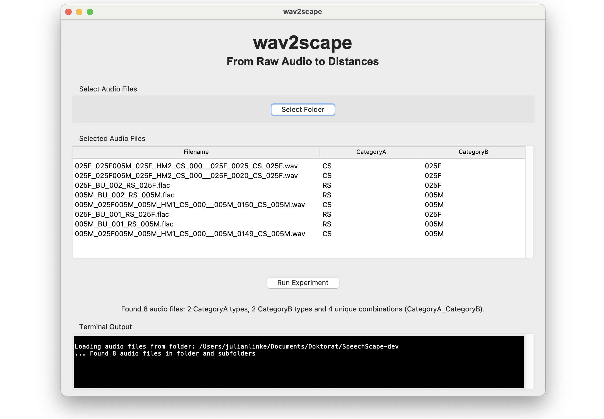
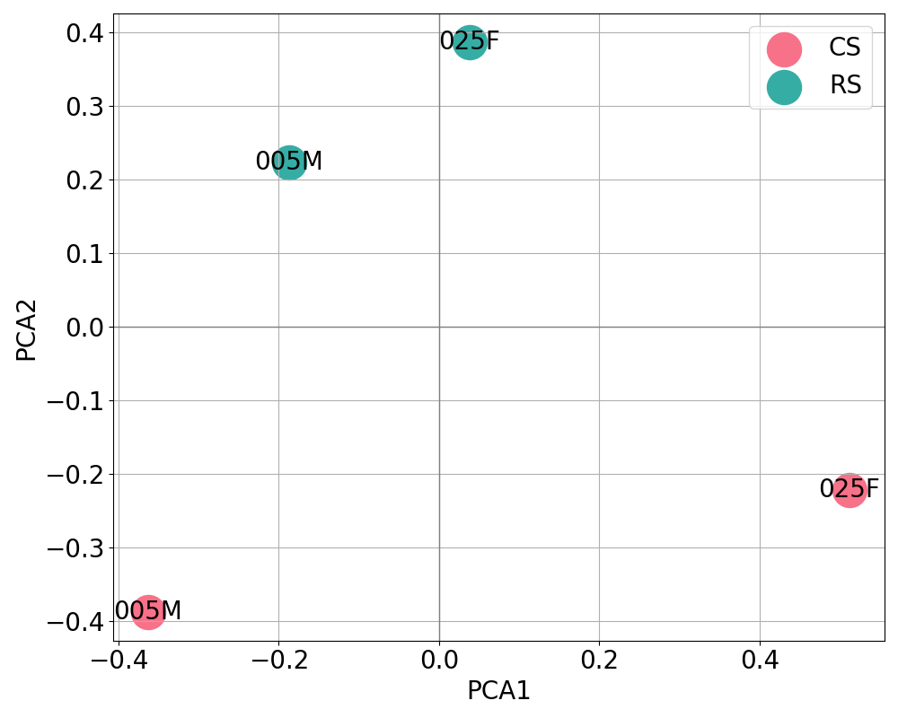
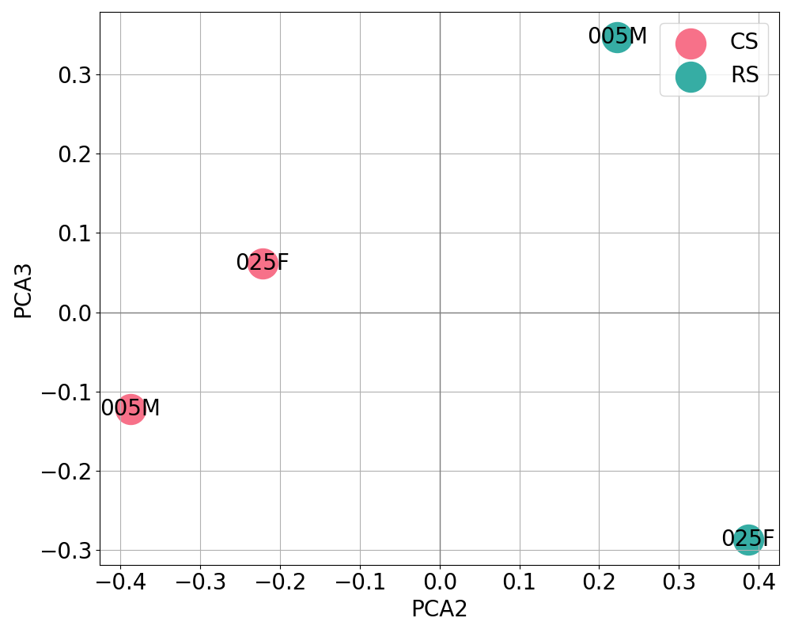

# wav2scape: From Raw Audio to Distances <!-- omit in toc -->

**An easy to use tool for analyzing speech data based on self-supervised representations** <!-- omit in toc -->

wav2scape is a user-friendly tool for analyzing acoustic similarities and distances between speech categories using self-supervised speech representations. It leverages the pre-trained wav2vec 2.0 XLSR-53 model, trained on 56,000 hours of multilingual speech data, to extract discrete codebook representations and compute similarity matrices between different speech categories.

<p align="center">
  
  <br>
  <em>wav2scape graphical user interface showing the analysis workflow</em>
</p>

<br>

<p align="center">
  
  
  
</p>
<p align="center">
  <em>wav2scape visualizations: similarity matrix and PCA scatter plots computed from example speech data</em>
</p>

<br>

<p align="center">
  
  <br>
  <em>Complete wav2scape workflow: from download to analysis results in 8 simple steps (macOS)</em>
</p>

## Table of Contents  <!-- omit in toc -->
- [What wav2scape Does](#what-wav2scape-does)
- [Data Requirements](#data-requirements)
- [Quick Start - Download Binaries](#quick-start---download-binaries)
  - [Windows](#windows)
  - [macOS](#macos)
  - [Linux](#linux)
- [Development Setup](#development-setup)
  - [1. Installation](#1-installation)
  - [2. Usage](#2-usage)
  - [3. Building Binaries](#3-building-binaries)
- [Technical Background](#technical-background)
- [Output Files and Validation](#output-files-and-validation)
  - [Visualization Files (`images/`)](#visualization-files-images)
    - [Similarity Heatmaps](#similarity-heatmaps)
    - [PCA Analysis Files](#pca-analysis-files)
    - [PCA Scatter Plots](#pca-scatter-plots)
  - [Detailed Logs (`logs/`)](#detailed-logs-logs)
- [Citation](#citation)
- [License](#license)
  - [Third-Party Licenses](#third-party-licenses)
- [Contributing](#contributing)
- [Support](#support)

## What wav2scape Does

wav2scape processes audio recordings and generates similarity matrices based on the frequency usage of shared discrete speech representations (codebook entries). The tool is flexible and can be applied to a wide range of acoustic dimensions, such as:

- **Languages and language varieties** (e.g., comparing different dialects or regional accents)
- **Speaking styles** (e.g., read vs. conversational speech)
- **Prosodic or prominence features**
- **Individual speakers or speaker groups**
- **Other user-defined or extra-linguistic categories**

These are just example applications — any categorical property reflected in your audio file naming convention can be analyzed.
> **Note:** While wav2scape can, in principle, process any audio recordings, its underlying representations are based on a model pre-trained exclusively on speech data. This means it is specifically optimized for speech and may not generalize well to non-speech audio.

**Simple workflow:** Add your raw audio files → Start analysis (runs entirely on your computer) → Get output folder with similarity matrices, PCA visualizations, and statistical summaries.

## Data Requirements

- **Audio format:** Mono audio files (16 kHz sampling rate recommended)
- **Supported formats:** `.wav`, `.mp3`, `.ogg`, `.flac`
- **Audio content:** Short speech segments or utterances (VAD-segmented audio recommended)
  - Typical duration: 1-10 seconds per file
  - Each file should contain a single utterance or speech segment
- **File naming convention:** `*_CategoryA_CategoryB.ext`
  - `CategoryA`: Primary grouping dimension (e.g., language, variety, style)
  - `CategoryB`: Secondary grouping dimension (e.g., speaker-ID)
- **Data amount recommendation:** Ensure a sufficient number of audio files per category combination for robust statistical representation. The exact amount depends on the complexity of your data.

**Example file structure:**
```
utterance001_English_SP01.wav    # e.g. 3.2 seconds
utterance002_English_SP01.wav    # e.g. 2.8 seconds
utterance003_English_SP02.wav    # e.g. 4.1 seconds
utterance001_German_SP01.wav     # e.g. 2.5 seconds
utterance002_German_SP01.wav     # e.g. 5.3 seconds
utterance003_German_SP02.wav     # e.g. 3.7 seconds
...
```

*In this example: CategoryA = language (English/German), CategoryB = speaker-ID (SP01/SP02)*

**Real example from provided test data ([`data/raw/GR/`](https://github.com/julianweblinke/wav2scape/raw/main/data/raw/GR.zip)) from the [GRASS corpus](https://www.spsc.tugraz.at/databases-and-tools/grass-the-graz-corpus-of-read-and-spontaneous-speech.html):**
```
005M_025F005M_005M_HM1_CS_000__005M_0149_CS_005M.wav
005M_025F005M_005M_HM1_CS_000__005M_0150_CS_005M.wav
005M_BU_001_RS_005M.flac
005M_BU_002_RS_005M.flac
025F_025F005M_025F_HM2_CS_000__025F_0020_CS_025F.wav
025F_025F005M_025F_HM2_CS_000__025F_0025_CS_025F.wav
025F_BU_001_RS_025F.flac
025F_BU_002_RS_025F.flac
```
*In this example: CategoryA = speaking style (CS/RS), CategoryB = speaker-ID (005M/025F)*

## Quick Start - Download Binaries

### Windows
[](https://github.com/julianweblinke/wav2scape/releases/download/v1.1/wav2scape-windows.zip)

1. Extract the downloaded zip file (`wav2scape-windows.zip`).
2. **Run as Administrator (required):**
   - Right-click on `wav2scape.exe`.
   - Select "Run as administrator" to ensure necessary permissions.
3. Follow the on-screen instructions to process your audio data.

**Note:** You must run as Administrator on Windows.

### macOS
[](https://github.com/julianweblinke/wav2scape/releases/download/v1.1/wav2scape-macos.tar.gz)

1. Extract the downloaded tarball (`wav2scape-macos.tar.gz`).
2. Open Terminal and navigate to the extracted folder.
3. **Set executable permissions for the application (required):**
   ```bash
   chmod +x wav2scape
   ```
4. Run the application:
   ```bash
   ./wav2scape
   ```

**Note:** You must run `chmod +x wav2scape` before executing the application.

### Linux
[](https://github.com/julianweblinke/wav2scape/releases/download/v1.1/wav2scape-linux-part1.tar)
[](https://github.com/julianweblinke/wav2scape/releases/download/v1.1/wav2scape-linux-part2.tar)
[](https://github.com/julianweblinke/wav2scape/releases/download/v1.1/wav2scape-linux-reassemble.sh)

Due to GitHub's file size limitations, the Linux binary is split into multiple parts.

**Installation steps:**
1. Download all Linux files from the release:
   - `wav2scape-linux-part1.tar`
   - `wav2scape-linux-part2.tar` 
   - `wav2scape-linux-reassemble.sh`
2. **Set executable permissions for the reassembly script (required):**
   ```bash
   chmod +x wav2scape-linux-reassemble.sh
   ```
3. Extract the binary parts in the same directory:
   ```bash
   tar -xf wav2scape-linux-part1.tar
   tar -xf wav2scape-linux-part2.tar
   ```
4. Run the reassembly script: `./wav2scape-linux-reassemble.sh`
5. Run the application: `./wav2scape`

**Note:** The reassembly script will automatically combine the split parts and make the binary executable.

## Development Setup

### 1. Installation

Create a conda environment for your platform:

```bash
# Clone the repository
git clone https://github.com/julianweblinke/wav2scape.git
cd wav2scape

# Create conda environment (choose your platform)
conda env create -f environmentLINUX.yml     # Linux
conda env create -f environmentMACOS.yml     # macOS  
conda env create -f environmentWINDOWS.yml   # Windows

# Activate environment
conda activate wav2scape
```

### 2. Usage

```bash
# Basic usage
python src/main.py

# Verbose mode (recommended for development)
python src/main.py --verbose
```

### 3. Building Binaries

Use the following PyInstaller command for all platforms:

```bash
pyinstaller --clean --onefile \
    --name wav2scape \
    --paths=./src \
    --hidden-import=controller \
    --hidden-import=filehandler \
    --hidden-import=gui \
    --hidden-import=ml \
    --hidden-import=utils \
    --hidden-import=scipy \
    --hidden-import=scipy._cyutility \
    --hidden-import=scipy.sparse._csparsetools \
    --hidden-import=scipy.sparse._sparsetools \
    src/main.py
```

## Technical Background

wav2scape is built on the wav2vec 2.0 framework and utilizes the XLSR-53 model for multilingual speech representation (see also [wav2vec 2.0 repository](https://github.com/facebookresearch/fairseq/tree/main/examples/wav2vec)). The tool processes audio recordings through the following pipeline:

1. **Feature Extraction:** Audio is processed through the pre-trained  XLSR-53 model
2. **Quantization:** Continuous representations are converted to discrete codebook indices using the model's quantization module
3. **Usage Analysis:** Frequency of codebook usage is computed for each category combination (CategoryA_CategoryB), resulting in a 102400-dimensional normalized vector representing the probability distribution over quantized speech representations; i.e., in probabilistic terms, P(codebook_index|CategoryA_CategoryB).
4. **Similarity Computation:** Jensen-Shannon Divergence is used to measure similarity between category combinations
5. **Visualization:** PCA is applied for dimensionality reduction and visualization

**Performance:** wav2scape runs on CPU to ensure compatibility across all systems without requiring GPU hardware. Processing time scales with the number of audio files, with time estimates provided during processing.


## Output Files and Validation

wav2scape generates comprehensive output files for analysis and validation across two main directories:

- **[Visualization Files](#visualization-files-images)** — Similarity matrices and PCA visualizations
- **[Detailed Logs](#detailed-logs-logs)** — Statistical summaries and validation data for each category combination

### Visualization Files (`images/`)

#### Similarity Heatmaps
- `similarity_matrix_autoscaled.png` — Heatmap with automatic color scaling
- `similarity_matrix_normalized.png` — Heatmap with fixed 0-1 color scale

#### PCA Analysis Files
- `PCA_matrix.csv` — PCA-reduced similarity matrix for custom analysis
- `PCA_eigenvalues.txt`, `PCA_eigenvectors.txt`, `PCA_variances.txt` — Technical details

#### PCA Scatter Plots
**For 3+ category combinations:** 6 plots total
- `AB_PCA1_vs_PCA2`, `AB_PCA1_vs_PCA3`, `AB_PCA2_vs_PCA3` (plus `BA_` variants)

**For 2 category combinations:** 2 plots total  
- `AB_PCA1_vs_PCA2`, `BA_PCA1_vs_PCA2`

**Plot types:**
- `AB_` plots: Colored by CategoryA, annotated with CategoryB
- `BA_` plots: Colored by CategoryB, annotated with CategoryA


### Detailed Logs (`logs/`)

**For each category combination (`CategoryA_CategoryB`):**
- `codebook_usage_vector.txt` — Raw usage counts for all 102400 codebook entries
- `normalized_codebook_usage_vector.txt` — Normalized usage distribution (sums to 1.0)
- `used_entries.txt` — List of codebook indices that were actually used
- `number_used_entries.txt` — Total count of unique codebook entries used
- `most_used_entries.txt` — Codebook entries ranked by frequency (index, count pairs)

**Interpretation Guidelines:** wav2scape provides an initial exploratory analysis to reveal acoustic patterns and relationships within your data. The visualization focuses on the first 3 PCA dimensions for interpretability, though higher-dimensional patterns may also contain valuable information. For comprehensive analysis, we recommend utilizing the detailed log files (`logs/`) which contain complete codebook usage statistics and enable custom similarity computations and deeper statistical investigation.


## Citation

If you use wav2scape, please cite the following two papers:

**Methodology Paper:**
```bibtex
@inproceedings{linke23_interspeech,
  title     = {What do self-supervised speech representations encode? An analysis of languages, varieties, speaking styles and speakers},
  author    = {Julian Linke and Mate Kadar and Gergely Dosinszky and Peter Mihajlik and Gernot Kubin and Barbara Schuppler},
  year      = {2023},
  booktitle = {Interspeech 2023},
  pages     = {5371--5375},
  doi       = {10.21437/Interspeech.2023-951},
  issn      = {2958-1796},
}
```

**Software citation:**
```bibtex
@software{wav2scape,
  author    = {Julian Linke},
  title     = {wav2scape: From Raw Audio to Distances — An easy-to-use tool for analyzing speech data based on self-supervised representations},
  url       = {https://github.com/julianweblinke/wav2scape},
  year      = {2025},
}
```

You may also reference the underlying wav2vec 2.0 model:

**Underlying Model (XLSR-53):**
```bibtex
@inproceedings{conneau21_interspeech,
  title     = {Unsupervised Cross-Lingual Representation Learning for Speech Recognition},
  author    = {Alexis Conneau and Alexei Baevski and Ronan Collobert and Abdelrahman Mohamed and Michael Auli},
  year      = {2021},
  booktitle = {Interspeech 2021},
  pages     = {2426--2430},
  doi       = {10.21437/Interspeech.2021-329},
  issn      = {2958-1796},
}
```


## License

This project is licensed under the MIT License - see the [LICENSE](LICENSE) file for details.

### Third-Party Licenses

wav2scape uses the following third-party components:

- **wav2vec 2.0 XLSR-53 model**: Licensed under MIT License by Facebook AI Research ([fairseq](https://github.com/facebookresearch/fairseq))
- **Transformers library**: Licensed under Apache 2.0 License by Hugging Face ([transformers](https://github.com/huggingface/transformers))
- **PyTorch**: Licensed under BSD 3-Clause License ([pytorch](https://github.com/pytorch/pytorch))

The pre-trained models are used as-is without modification. Please refer to their respective repositories for detailed license information.

## Contributing

Contributions are welcome! Please feel free to submit a Pull Request.

## Support

If you encounter any issues or have questions, please open an issue on GitHub.
